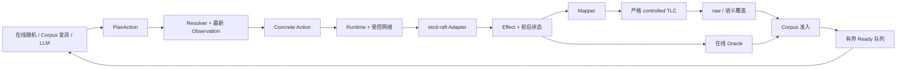

# ModelFuzz-NG：etcd-raft 系统说明与原始 ModelFuzz 对比

本文说明 ModelFuzz-NG（下文简称 NG）如何测试 etcd-raft、如何处理 Raft 事件，以及它与原始 ModelFuzz etcd 测试器的主要差异。双方的轨迹单位、Tick 语义和状态抽象不同，因此不能直接用 raw 状态数衡量相对搜索效率。

## 1. 系统目标与执行闭环

NG 在本地进程中运行一组 etcd-raft `RawNode`，控制逻辑时间、客户端请求、节点 crash/restart 和消息网络，再把实现行为映射到 Raft TLA+ 模型。系统同时保留 Concrete SUT 行为、模型状态以及搜索反馈，从而形成可解释、可重放、可恢复的测试闭环。



| 阶段          | 作用                                                                     |
| ------------- | ------------------------------------------------------------------------ |
| Plan 生成     | 随机策略、Corpus 变异或 LLM 生成高层动作意图                             |
| 解析与执行    | 根据最新 Observation 绑定 MessageID、队列位置和绝对时间，再驱动真实 Raft |
| 模型与 Oracle | 将 Concrete Transition 映射到 TLA+，同时检查实现层安全属性               |
| 覆盖反馈      | 用模型状态和转移决定 Corpus 准入，并生成后续候选                         |

初始随机轨迹是在线、状态感知的：每执行一个动作，策略都会读取新的 Leader、角色、term、日志边界和消息队列，再决定下一个动作。Corpus 变异保存的是较稳定的 Plan；执行时仍由 Resolver 根据最新状态选择最终消息。因此，NG 不是先生成一批固定 Concrete Trace 再机械运行。

## 2. etcd-raft 执行与事件处理

### 2.1 Ready、存储与节点生命周期

Adapter 完整消费每次操作产生的 `Ready`，并按 etcd-raft 契约维护稳定状态：

| Ready 内容       | Adapter 行为                       | 目的                                    |
| ---------------- | ---------------------------------- | --------------------------------------- |
| Snapshot         | 应用非空 snapshot                  | 恢复日志和成员配置基线                  |
| HardState        | 调用`SetHardState`               | 持久化 term、vote 和 commit             |
| Entries          | 追加到`MemoryStorage`            | 保留日志并支持 restart                  |
| CommittedEntries | 更新 applied、前缀摘要和 ConfState | 支持 commit 与一致性 Oracle             |
| Messages         | 转交 Runtime 受控网络              | 支持延迟、投递、复制、丢弃以及分区/合并 |
| Advance          | 排空本次操作产生的 Ready           | 完成 Raft Ready 契约                    |

节点 crash 后保留稳定存储和在途消息；restart 从稳定存储重建易失状态并增加 epoch。Raft 选举随机数由实验 seed 派生，因此不依赖 wall clock 或进程全局随机源。

### 2.2 Concrete Action

| Action                   | Concrete 行为                         | 模型处理                                                |
| ------------------------ | ------------------------------------- | ------------------------------------------------------- |
| `Deliver`              | 按最终 MessageID 投递受控消息         | 根据消息语义映射                                        |
| `Drop`                 | 从 Runtime 网络移除消息               | stutter                                                 |
| `Partition` / `Heal` | 阻断跨组投递但保留队列 / 恢复跨组投递 | stutter；后续协议事件照常映射                           |
| `Duplicate`            | 复制消息并分配新 MessageID            | stutter；副本投递时再映射                               |
| `Request`              | 对目标节点调用`Propose`             | 只有 Leader 实际接受时映射`ClientRequest`             |
| `Timeout`              | 对节点调用`Campaign`                | term 实际增加时映射`Timeout`；Leader 无变化时 stutter |
| `AdvanceTime`          | 每单位时间对所有运行节点各 Tick 一次  | 映射实际触发的 timeout、心跳和消息                      |
| `Crash`                | 停止节点并保留稳定状态                | `Remove`                                              |
| `Restart`              | 从稳定状态重建节点                    | `Add`                                                 |

随机策略优先投递消息，并通过可配置权重和 cooldown 限制强制 timeout 与 crash；已有 Leader 时还会进一步降低 timeout 概率。

### 2.3 Raft 网络消息

| Raft 消息                               | 当前处理                                                                                                            |
| --------------------------------------- | ------------------------------------------------------------------------------------------------------------------- |
| `MsgVote` / `MsgVoteResp`           | 映射投票请求/响应，保留 term、日志和 reject 信息                                                                    |
| `MsgApp`                              | 映射 AppendEntries；安全的多 entry 批次按日志顺序展开                                                               |
| `MsgAppResp`                          | 映射复制响应和进度确认                                                                                              |
| `MsgHeartbeat`                        | 映射为无 entry 的 AppendEntries，保留 term 与 commit 传播                                                           |
| `MsgHeartbeatResp`                    | 当前模型不表达，显式 stutter                                                                                        |
| `MsgReadIndex` / `MsgReadIndexResp` | ReadIndex 未进入当前模型，显式 stutter                                                                              |
| `MsgProp`                             | Follower 转发请求时进入受控网络；投递到当前 Leader 后才形成`ClientRequest`                                        |
| `MsgSnap`                             | Concrete 层受控发送、丢弃、复制和应用；storage-snapshot 区分 Send、Install、FastForward、Reject 和成功/失败状态反馈 |
| `MsgTimeoutNow`、`MsgPreVote` 等    | 当前 Profile 不支持，明确报错而非静默忽略                                                                           |
| `MsgHup` / `MsgBeat`                | Raft 本地消息，不进入 Runtime 网络                                                                                  |

定向 snapshot 策略逐步读取最新 Observation，不预先绑定 MessageID；当前覆盖分区后 snapshot 追赶、已有 matching suffix 的 fast-forward，以及首次传输失败后的重试，并支持3节点和5节点配置。

### 2.4 角色、提交、snapshot 和 proposal drop

| Concrete 事件                  | 模型处理                                                         | 说明                                           |
| ------------------------------ | ---------------------------------------------------------------- | ---------------------------------------------- |
| 节点成为 Leader                | `BecomeLeader`                                                 | 必须满足正确模型的 quorum 前置条件             |
| Leader 追加当前 term no-op     | `ClientRequest(request=0)`                                     | 对齐 etcd-raft Leader no-op                    |
| Leader commit 推进             | `AdvanceCommitIndex`                                           | 与 committed entry Effect 对齐                 |
| committed entry 应用与本地存储 | `ApplyCommitted`、`CreateSnapshot`、`CompactLog`           | 扩展 profile 验证 applied、snapshot 和压缩边界 |
| snapshot 发送与状态反馈        | `SendSnapshot`、`HandleSnapshotStatus`                       | 验证发送条件、pending progress 和失败重试      |
| snapshot 的 Follower 处理      | `InstallSnapshot`、`FastForwardSnapshot`、`RejectSnapshot` | 区分安装、已有匹配日志和旧/重复 snapshot       |
| 动态成员变更                   | 明确不支持                                                       | 当前轻量模型尚未覆盖                           |
| `raft.proposal_dropped`      | stutter                                                          | 统计可见，但不是 runtime failure               |

Follower 转发的 proposal 可能因为 Leader 已变化或集群暂时没有 Leader 而返回 `ErrProposalDropped`。这是合法异步结果。NG 对直接和转发来源分别记录 `raft.proposal_dropped{source=direct|forwarded}`；转发投递仍记录 `raft.message_delivered`，但 proposal drop 不进入 `runtime_error`。

### 2.5 常见非失败与失败口径

| 原因/状态                  | 含义                                      | 是否失败                   |
| -------------------------- | ----------------------------------------- | -------------------------- |
| `message_not_available`  | 计划选择的链路当前为空                    | 否，本次 PlanAction 不适用 |
| `selector_start_clamped` | 链路非空但 Start 越界，钳制到最后一个位置 | 否，继续执行最终消息       |
| `model_bound_reached`    | 下一动作会越过有限 term/log 边界          | 否，正常保存已有前缀       |
| `timeout_term_bound`     | timeout 导致的 term 边界子原因            | 否                         |
| `runtime_error`          | Runtime/Adapter 返回非预期错误            | 是                         |
| `sut_panic`              | 同步 SUT 边界捕获到 panic                 | 是                         |
| `model_failed`           | TLC 拒绝事件或 invariant 失败             | 是                         |
| `oracle_failed`          | Concrete 在线安全属性被违反               | 是                         |

`model_bound_reached` 较高表示搜索经常用完有限模型预算，不表示 SUT 有同等比例的失败。它会缩短部分轨迹，因此仍应持续观察，但不能计入正确性失败。

## 3. 覆盖反馈与持久化

| 覆盖口径        | 定义                                                            | 用途                                     |
| --------------- | --------------------------------------------------------------- | ---------------------------------------- |
| raw model state | TLC 原始 fingerprint                                            | 与模型完整状态直接对齐                   |
| 语义状态        | 活动节点、角色、相对 term、日志形状、commit/复制 lag 和投票关系 | 合并只在绝对 term 或内部记账上不同的状态 |
| 语义转移        | `语义前态 + 事件名 + 语义后态`                                | 区分到达相似状态的不同协议行为           |

Corpus 准入同时使用可配置的 raw 覆盖门槛和语义 novelty，避免只因绝对 term 或内部记账变化保留轨迹。

| 反馈/持久化机制   | 当前行为                                                                |
| ----------------- | ----------------------------------------------------------------------- |
| Mutation 与 Ready | 变异数和 Ready 容量均有上限；队列满时确定性淘汰最旧候选                 |
| Corpus 与 Run     | 完整记录追加到 JSONL，摘要和覆盖键保持紧凑                              |
| checkpoint/resume | 保存覆盖、水位、聚合统计和反馈队列；恢复时修复 JSONL 尾部并截断孤儿记录 |
| minimization      | 失败 Plan 的缩减过程可以 checkpoint 和恢复                              |
| 配置指纹          | 禁止改变节点、模型边界、策略或 mutator 后错误续跑                       |

关键背压指标是 `admitted_mutations`、`discarded_mutations` 和 `peak_ready_candidates`；Ready 峰值始终不得超过配置上限。

## 4. 与原始 ModelFuzz 的 etcd 测试器对比

原始系统使用固定 100 step 模板：每个 step 依次尝试 crash、restart、一次方向队列投递和 client request，最后固定 Tick 所有节点。一个 step 可能展开成多个实现操作，因此不能与 NG 的原子 Concrete Action 一一换算。

| 能力                     | 原始 ModelFuzz                                           | NG                                                                                              | 对比结论                                          |
| ------------------------ | -------------------------------------------------------- | ----------------------------------------------------------------------------------------------- | ------------------------------------------------- |
| 受控网络                 | `from→to` FIFO 队列，批量投递队头消息                 | MessageID/Link/Position，支持 Drop/Duplicate 和持久分区/合并                                    | NG 粒度更细                                       |
| 调度生成                 | 预生成固定 step，统一 Tick 所有节点                      | PlanAction 顺序自由，每步读取最新 Observation，时间推进可独立控制                               | NG 更具状态感知性                                 |
| 模型执行严格性           | 原 controlled 路径可能跳过 disabled Action               | 严格拒绝 disabled、多后继和 invariant 违反                                                      | NG 诊断更严格                                     |
| 覆盖反馈                 | TLC fingerprint                                          | raw + 语义状态 + 语义转移                                                                       | NG 增加归一化口径                                 |
| 本地变异                 | 交换 crash 节点、方向选择和投递数量                      | 变异原子 PlanAction，并在线解析                                                                 | 双方都有，表示不同                                |
| line/trace coverage 基线 | 已实现                                                   | 当前未实现                                                                                      | 原系统有、NG 暂无                                 |
| 确定性与重放             | 方向和数量可重放，具体消息仍依赖队列                     | seed 派生随机源，并校验 MessageID、位置、Effect 和状态摘要                                      | NG 更严格                                         |
| 在线 Oracle              | assertion/crash 和简单 serializability                   | 另有 term/commit、Leader、committed-prefix、持久性 Oracle                                       | NG 检查更细                                       |
| snapshot                 | 论文模型记录 snapshot index；artifact 存储生命周期不完整 | Concrete 生命周期完整；TLA+ 覆盖固定 voter 的 Apply/Create/Compact/Send/Install/Reject/Response | NG 边界更细；动态 ConfState 与异常 payload 未覆盖 |
| 长跑工程能力             | 无闭环确定性恢复和显式反馈上限                           | checkpoint/resume、JSONL 水位、配置指纹和有界反馈队列                                           | NG 更适合持续实验                                 |
| LLM 生成/变异            | 主 fuzz 闭环未接入                                       | 已有接口、校验和成本统计                                                                        | NG 已实现接口，但尚未证明收益                     |

### 4.1 为什么原始 ModelFuzz 运行较慢

原始 artifact 的开销主要来自 TLC Action 预枚举、固定 step 中的冗余 Tick/空队列投递，以及状态抽象、轨迹比较和覆盖插桩。NG 改为按收到的事件创建并缓存 Action，并使用在线状态感知生成和有界反馈队列。

在3节点、`MaxValue=5` 下，按原 `raft_alt.Next` 的参数域计算，预枚举规模会随 term 和 log index 边界快速增长：

| `LargestTerm/MaxLogIndex` | 预枚举 Action 数 | 相对 10/10 |
| --------------------------- | ---------------: | ---------: |
| 5/5                         |          434,298 |    0.049× |
| 10/10                       |        8,842,908 |        1× |
| 20/20                       |      222,383,478 |    25.15× |

其中 20/20 下仅 `HandleAppendEntriesRequest` 就有 220,541,454 种组合，因为它的规模为 `3² × 21³ × 21² × 6`。原系统还会为这些 Action 建立分类列表和字符串索引，因此 20/20 在普通 JVM heap 下很可能在启动阶段 OOM，而不只是运行变慢；NG 只为轨迹中实际收到的事件创建 Action，避免了这部分组合爆炸。

NG 在消息控制、严格重放、错误诊断和长跑恢复方面更完整，但双方口径不同，不能只依据单位时间状态数得出绝对性能结论。

## 5. 原始 ModelFuzz 所称的“两个 bug”

原论文的 etcd 小节包含一个人工 seeded bug 和一个声称新发现的 missing-snapshot crash，不能表述成“发现了两个新的 etcd bug”。

### 5.1 n/3+1 quorum：人工注入 mutant

原系统把正确选举阈值 `floor(n/2)+1` 改成 `floor(n/3)+1`。这是用于比较检测能力的人工 mutant，不是未修改 etcd-raft 中自然存在的缺陷。

NG 已得到三 Action 最短 Plan：五节点 Candidate 只有两票却成为 Leader，TLC 在 `BecomeLeader` 返回 `disabled_action`；在线随机轨迹和 Concrete Oracle 也能发现相同的弱 quorum 分歧。因此，该 mutant 已被稳定复现，但不能称为新 etcd 生产 bug。

### 5.2 missing snapshot：论文主张与本地证据

论文称原 ModelFuzz 除 seeded quorum mutant 外，还发现了一个正常 etcd-raft 在访问缺失 snapshot 时崩溃的问题，并将其报告为 issue 108。这里的 “missing snapshot” 不是指网络把 `MsgSnap` 数据包弄丢了，而是指：

```text
Leader 已经没有 Follower 所需的旧日志，
但 Leader 的本地 Storage 又拿不出可以替代这些日志的有效 snapshot。
```

可以把它类比成“账本旧页已经销毁，但归档副本实际上不存在”。Leader 既不能继续发送旧日志，也没有归档可以帮助落后节点恢复。

#### 5.2.1 一个具体例子

假设 Leader 最初保存日志 `1..10`。应用在 index 6 创建 snapshot，并在确认 snapshot 可用后压缩日志：

```text
snapshot：包含截至 index 6 的状态
剩余日志：7 8 9 10
```

如果一个长期离线的 Follower 只复制到 index 2，它恢复后原本需要日志 3。Leader 已经压缩了 `3..6`，因此正确做法是先发送 index 6 的 snapshot，Follower 安装后再继续接收 `7..10`：

```text
Follower 需要 index 3
        ↓
Leader 发现 index 3 已早于 FirstIndex
        ↓
Leader 从 Storage 读取 index 6 snapshot
        ↓
发送 MsgSnap
        ↓
Follower 安装 snapshot，再继续复制 7..10
```

missing snapshot 是其中第四步变成了：

```text
Leader 从 Storage 读取 snapshot
        ↓
Storage 只返回空的初始 snapshot
        ↓
Leader 没有任何数据可以让 Follower 恢复
        ↓
panic("need non-empty snapshot")
```

空 snapshot 在系统尚未创建过 snapshot 时本身是合法的。真正矛盾的是：Raft 已经确认旧日志不可用、必须改发 snapshot，但应用仍然只能提供空值。

#### 5.2.2 与其他 snapshot 情况的区别

| 情况                             | 实际含义                                         | 正常结果                                            |
| -------------------------------- | ------------------------------------------------ | --------------------------------------------------- |
| missing snapshot                 | Leader 本地没有覆盖已删除日志的有效 snapshot     | 表示存储边界矛盾，可能触发防御性 panic              |
| `MsgSnap` 被网络 Drop          | Leader 有 snapshot，只是本次传输失败             | 报告`SnapshotFailure`、回退 progress，之后重试    |
| snapshot temporarily unavailable | 应用明确表示 snapshot 正在生成，当前暂时不能读取 | 本轮不发送，之后重试，不应触发 empty-snapshot panic |
| 旧或重复 snapshot 到达           | Follower 已经拥有相同或更新状态                  | 归类为 Reject/Stale，不回退已经安装的状态           |

因此，“能够随机 Drop `MsgSnap`”不等于制造了 missing snapshot。前者是正常网络故障路径，后者是 Leader 本地日志与 snapshot 生命周期不一致。

#### 5.2.3 etcd-raft 为什么选择 panic

Raft 核心库不会替应用自动创建 snapshot。应用必须先对已经应用的日志调用 `CreateSnapshot`，确认 snapshot 已经持久化，再调用 `Compact` 删除被覆盖的日志。

`maybeSendAppend` 在以下条件同时成立时才会进入该 panic：

| 条件                                                         | 通俗解释                                        |
| ------------------------------------------------------------ | ----------------------------------------------- |
| `term(Progress.Next-1)` 或 `entries(Progress.Next)` 失败 | Follower 要的旧日志已经读不到                   |
| Follower`RecentActive=true`                                | Raft 认为这个 Follower 在线，值得立即帮助它追赶 |
| snapshot 查询没有返回普通错误或 temporarily unavailable      | Storage 声称查询已经正常完成                    |
| `IsEmptySnap(snapshot)=true`                               | 但查询结果又没有任何可发送的 snapshot           |

这是一条防御性断言：既然应用允许旧日志消失，就应当保留能够替代它们的 snapshot。触发 panic 说明至少有一个地方不一致，但仅凭 panic 本身不能判断责任一定在 Raft 核心：

- Raft 内部的 `Progress.Next` 或日志状态可能进入了不可能状态；
- 应用或测试 harness 也可能先删除日志、却没有创建 snapshot；
- crash/restart 后的 HardState、ConfState 或稳定日志也可能恢复错误。

#### 5.2.4 原始 artifact 的存储契约缺口

本地原始 artifact 存在以下问题：

| 存储内容  | 原始 artifact 行为                                  | 可能产生的偏差                              |
| --------- | --------------------------------------------------- | ------------------------------------------- |
| Entries   | 调用`Append(rd.Entries)`                          | 这一部分有持久化                            |
| HardState | 没有对非空`rd.HardState` 调用 `SetHardState`    | restart 后可能丢失 term、vote 或 commit     |
| ConfState | 初始成员直接注入运行中的 RawNode                    | restart 时缺少持久成员配置                  |
| Snapshot  | 只应用收到的 snapshot，不主动调用`CreateSnapshot` | Raft 需要发送 snapshot 时可能仍只有空初始值 |
| 日志压缩  | 不调用`Compact`                                   | 没有形成完整的 create → compact 生命周期   |

如果日志从未压缩，Leader 正常情况下仍能读取 Follower 所需的旧 entry，本来不应进入 snapshot 分支。原 artifact 又没有完整恢复 HardState 和 ConfState，因此 crash/restart 后的组合状态不一定代表一个正确的 etcd-raft 集成。看到 `need non-empty snapshot` 只能证明“当前状态互相矛盾”，不能直接证明“etcd-raft 算法存在独立缺陷”。

NG 会持久化 HardState 和 ConfState，并坚持先创建 snapshot、再压缩被覆盖日志。扩展 TLA+ profile 与 Concrete Oracle 还会检查 snapshot 创建、压缩、发送、安装、拒绝、传输状态和 committed prefix，尽量避免测试框架自己制造这种假状态。

#### 5.2.5 本地 panic 的因果机制

本地出现的空 snapshot panic 都依赖 n/3+1 mutant，调用链为 `stepLeader → maybeSendAppend → maybeSendSnapshot → panic("need non-empty snapshot")`：

```text
n/3+1 弱 quorum
        ↓
缺少已提交日志的节点也能成为 Leader
        ↓
日志更完整的 Follower 返回该 Leader 无法解释的复制位置
        ↓
Leader 的 Progress 越过自身日志边界
        ↓
Leader 无法构造 MsgApp，错误地转入 snapshot 发送路径
        ↓
原 artifact 又只有空的初始 snapshot
        ↓
panic("need non-empty snapshot")
```

这说明本地观察到的 panic 是弱 quorum 先破坏 Raft 安全性后产生的下游故障信号。当前证据没有得到“正常 quorum 自己走到同一 panic”的独立反例，因此不能把它和 n/3+1 mutant 计为两个彼此独立的缺陷。

### 5.3 判断与当前结论

要把 missing-snapshot crash 认定为独立 etcd-raft 缺陷，必须在正常 quorum、正确 Ready/持久化契约和合法 snapshot/compaction 顺序下得到精确可重放的最小轨迹。

| 问题                          | 当前结论                                                                 |
| ----------------------------- | ------------------------------------------------------------------------ |
| n/3+1                         | 人工 mutant；NG 已通过最短 Plan、随机轨迹和 Oracle 检测                  |
| 本地空 snapshot panic         | 当前均依赖 n/3+1 mutant，不是独立第二个 bug                              |
| panic 的归因                  | 单独出现 panic 不足以区分 Raft 缺陷与 harness 存储契约错误               |
| 论文所称 missing-snapshot bug | 尚未在正常 quorum 和正确持久化契约下独立复现，也没有足够证据断言论文误报 |

## 6. 当前能力边界

| 主题                                    | 当前状态                                                                                                                                   |
| --------------------------------------- | ------------------------------------------------------------------------------------------------------------------------------------------ |
| Snapshot                                | Concrete 生命周期和 Oracle 已实现；扩展 TLA+ 覆盖固定 voter 的安装、自然 fast-forward、传输失败和重试；动态 ConfState、异常 payload 待建模 |
| 动态 membership / PreVote / CheckQuorum | 当前模型尚未完整支持                                                                                                                       |
| LLM                                     | 接口已经接通，尚无实验表明优于随机基线                                                                                                     |
| 性能对比                                | 可报告 NG 本地吞吐，但不能直接用 raw 状态数对比原论文                                                                                      |
| Missing snapshot                        | 已解释 panic 机制，尚未完成正常 quorum 下的独立复现                                                                                        |

详细实验记录见 [`experiments/README.md`](experiments/README.md)。
