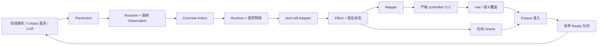

# ModelFuzz-NG：etcd-raft 系统说明与原始 ModelFuzz 对比

本文基于 2026-07-22 的本地代码、实验产物、原始 ModelFuzz artifact 源码和论文 PDF，集中说明 ModelFuzz-NG（下文简称 NG）如何测试 etcd-raft、如何处理 Raft 事件、当前实验结果，以及它与原始 ModelFuzz etcd 测试器的主要差异。不同版本的轨迹长度和状态定义并不相同，因此文中的跨版本数据只用于说明工程变化，不作为严格性能 A/B。

## 1. 系统目标与执行闭环

NG 在本地进程中运行一组 etcd-raft `RawNode`，控制逻辑时间、客户端请求、节点 crash/restart 和消息网络，再把实现行为映射到 Raft TLA+ 模型。系统同时保留 Concrete SUT 行为、模型状态以及搜索反馈，从而形成可解释、可重放、可恢复的测试闭环。



| 阶段 | 输入 | 输出 | 作用 |
| --- | --- | --- | --- |
| 策略生成 | 最新状态、Corpus 或 LLM 响应 | `PlanAction` | 生成高层动作意图 |
| 在线解析 | `PlanAction` + 当前 Observation | Concrete Action | 绑定真实节点、MessageID 和队列位置 |
| Concrete 执行 | Concrete Action | Effect、前后 Observation、Trace | 驱动真实 Raft 并记录证据 |
| 模型映射 | Concrete Transition | 0..N 个模型事件 | 把实现行为投影到 TLA+ |
| TLC 与 Oracle | 模型事件、Concrete 状态 | 模型后继或 Finding | 检查抽象一致性和实现安全属性 |
| 覆盖反馈 | 模型状态与转移 | Corpus 决策和新候选 | 引导后续变异 |

初始随机轨迹是在线、状态感知的：每执行一个动作，策略都会读取新的 Leader、角色、term、日志边界和消息队列，再决定下一个动作。Corpus 变异保存的是较稳定的 Plan；执行时仍由 Resolver 根据最新状态选择最终消息。因此，NG 不是先生成一批固定 Concrete Trace 再机械运行。

## 2. etcd-raft 执行与事件处理

### 2.1 Ready、存储与节点生命周期

Adapter 完整消费每次操作产生的 `Ready`，并按 etcd-raft 契约维护稳定状态：

| Ready 内容 | Adapter 行为 | 目的 |
| --- | --- | --- |
| Snapshot | 应用非空 snapshot | 恢复日志和成员配置基线 |
| HardState | 调用 `SetHardState` | 持久化 term、vote 和 commit |
| Entries | 追加到 `MemoryStorage` | 保留日志并支持 restart |
| CommittedEntries | 更新 applied、前缀摘要和 ConfState | 支持 commit 与一致性 Oracle |
| Messages | 转交 Runtime 受控网络 | 支持延迟、投递、复制和丢弃 |
| Advance | 排空本次操作产生的 Ready | 完成 Raft Ready 契约 |

节点 crash 后保留稳定存储和在途消息；restart 从稳定存储重建易失状态并增加 epoch。Raft 选举随机数由实验 seed 派生，因此不依赖 wall clock 或进程全局随机源。

### 2.2 Concrete Action

| Action | Concrete 行为 | 模型处理 |
| --- | --- | --- |
| `Deliver` | 按最终 MessageID 投递受控消息 | 根据消息语义映射 |
| `Drop` | 从 Runtime 网络移除消息 | stutter |
| `Duplicate` | 复制消息并分配新 MessageID | stutter；副本投递时再映射 |
| `Request` | 对目标节点调用 `Propose` | 只有 Leader 实际接受时映射 `ClientRequest` |
| `Timeout` | 对节点调用 `Campaign` | term 实际增加时映射 `Timeout`；Leader 无变化时 stutter |
| `AdvanceTime` | 每单位时间对所有运行节点各 Tick 一次 | 映射实际触发的 timeout、心跳和消息 |
| `Crash` | 停止节点并保留稳定状态 | `Remove` |
| `Restart` | 从稳定状态重建节点 | `Add` |

随机策略默认提高 Deliver、降低 timeout 和 crash：一次强制 timeout 后 4 个 Action 内不再生成新的强制 timeout；已有 Leader 时 timeout 权重进一步降低。相邻 crash 周期至少间隔 48 个 Action，含义是 cooldown 内 crash 不作为候选，而不是第 48 个 Action 自动触发 crash。

### 2.3 Raft 网络消息

| Raft 消息 | 当前处理 |
| --- | --- |
| `MsgVote` / `MsgVoteResp` | 映射投票请求/响应，保留 term、日志和 reject 信息 |
| `MsgApp` | 映射 AppendEntries；安全的多 entry 批次按日志顺序展开 |
| `MsgAppResp` | 映射复制响应和进度确认 |
| `MsgHeartbeat` | 映射为无 entry 的 AppendEntries，保留 term 与 commit 传播 |
| `MsgHeartbeatResp` | 当前模型不表达，显式 stutter |
| `MsgReadIndex` / `MsgReadIndexResp` | ReadIndex 未进入当前模型，显式 stutter |
| `MsgProp` | Follower 转发请求时进入受控网络；投递到当前 Leader 后才形成 `ClientRequest` |
| `MsgSnap` | Concrete 层受控发送、丢弃、复制和应用；基础 TLA+ 模型中显式 stutter |
| `MsgTimeoutNow`、`MsgPreVote` 等 | 当前 Profile 不支持，明确报错而非静默忽略 |
| `MsgHup` / `MsgBeat` | Raft 本地消息，不进入 Runtime 网络 |

### 2.4 角色、提交、snapshot 和 proposal drop

| Concrete 事件 | 模型处理 | 说明 |
| --- | --- | --- |
| 节点成为 Leader | `BecomeLeader` | 必须满足正确模型的 quorum 前置条件 |
| Leader 追加当前 term no-op | `ClientRequest(request=0)` | 对齐 etcd-raft Leader no-op |
| Leader commit 推进 | `AdvanceCommitIndex` | 与 committed entry Effect 对齐 |
| snapshot 创建、发送、投递、应用、拒绝 | stutter | Concrete 指标可见；基础模型没有完整 InstallSnapshot 状态 |
| 日志压缩 | stutter | 由 Adapter 和 committed-prefix Oracle 检查 |
| 动态成员变更 | 明确不支持 | 当前轻量模型尚未覆盖 |
| `raft.proposal_dropped` | stutter | 统计可见，但不是 runtime failure |

Follower 转发的 proposal 可能因为 Leader 已变化或集群暂时没有 Leader 而返回 `ErrProposalDropped`。这是合法异步结果。NG 对直接和转发来源分别记录 `raft.proposal_dropped{source=direct|forwarded}`；转发投递仍记录 `raft.message_delivered`，但 proposal drop 不进入 `runtime_error`。

### 2.5 常见非失败与失败口径

| 原因/状态 | 含义 | 是否失败 |
| --- | --- | --- |
| `message_not_available` | 计划选择的链路当前为空 | 否，本次 PlanAction 不适用 |
| `selector_start_clamped` | 链路非空但 Start 越界，钳制到最后一个位置 | 否，继续执行最终消息 |
| `model_bound_reached` | 下一动作会越过有限 term/log 边界 | 否，正常保存已有前缀 |
| `timeout_term_bound` | timeout 导致的 term 边界子原因 | 否 |
| `runtime_error` | Runtime/Adapter 返回非预期错误 | 是 |
| `sut_panic` | 同步 SUT 边界捕获到 panic | 是 |
| `model_failed` | TLC 拒绝事件或 invariant 失败 | 是 |
| `oracle_failed` | Concrete 在线安全属性被违反 | 是 |

`model_bound_reached` 较高表示搜索经常用完有限模型预算，不表示 SUT 有同等比例的失败。它会缩短部分轨迹，因此仍应持续观察，但不能计入正确性失败。

## 3. 覆盖反馈与持久化

| 覆盖口径 | 定义 | 用途 |
| --- | --- | --- |
| raw model state | TLC 原始 fingerprint | 与模型完整状态直接对齐 |
| 语义状态 | 活动节点、角色、相对 term、日志形状、commit/复制 lag 和投票关系 | 合并只在绝对 term 或内部记账上不同的状态 |
| 语义转移 | `语义前态 + 事件名 + 语义后态` | 区分到达相似状态的不同协议行为 |

默认情况下，一条成功轨迹只有新增至少 25 个全局 raw 状态，并且新增语义状态或语义转移时，才会进入 Corpus。

| 反馈/持久化机制 | 当前行为 |
| --- | --- |
| Mutation | 每个新状态默认生成 1 个变异，每条 Corpus 最多 2 个 |
| Ready 队列 | 默认上限 4096；满时确定性淘汰最旧候选 |
| Corpus | 紧凑覆盖摘要写入 `corpus.json`；完整 entry 追加到 `corpus.jsonl` |
| Run 记录 | 逐条追加到 `runs.jsonl` |
| checkpoint v7 | 保存覆盖键、水位、聚合统计、有界 Ready 和待处理引用，不保存完整 Trace |
| resume | 按 checkpoint 水位修复 JSONL 尾部并截断孤儿记录 |
| 配置指纹 | 禁止改变节点、模型边界、策略或 mutator 后错误续跑 |

关键背压指标是 `admitted_mutations`、`discarded_mutations` 和 `peak_ready_candidates`；Ready 峰值始终不得超过配置上限。

## 4. 典型实验结果

### 4.1 修复后 30 分钟实验

目录：`runs/feedback-soak-30m-postfix-20260722`。配置使用 seed=884000、LargestTerm/MaxLogIndex=10/10、语义覆盖开启、每条最多 300 个 PlanAction。

| 指标 | 结果 |
| --- | ---: |
| completed / succeeded / failed | 8,197 / 8,197 / 0 |
| Concrete Action / 模型事件 | 1,905,565 / 1,215,917 |
| 吞吐 | 1,058.05 Action/s；4.55 run/s |
| raw 模型状态 | 232,471 |
| 语义状态 / 语义转移 | 160,867 / 256,805 |
| semantic novelty | 21.9185 / 100 Action |
| Corpus / 准入率 | 3,293 / 40.17% |
| Ready 峰值 / discarded mutation | 17 / 0 |
| proposal dropped | 17,027，全部为可见 stutter |
| runtime error / TLC failure | 0 / 0 |
| checkpoint / corpus.jsonl / runs.jsonl | 28 / 68 / 34 MiB |

动作分布中 Deliver=59.53%，强制 timeout=2.36%，crash+restart=2.28%。`message_not_available=101,207`，占 Action 5.31%；`selector_start_clamped=40,021`，占 2.10%；`model_bound_reached=1,588`，占完成 run 的 19.37%。JVM 结束前 RSS 约 253 MiB，没有 OOM。

### 4.2 旧 v5 两小时实验与当前结果

| 指标 | 旧 v5 两小时实验 | v7 30 分钟实验 | 主要变化 |
| --- | ---: | ---: | --- |
| completed | 87,000 | 8,197 | 实验时长和轨迹配置不同 |
| succeeded / failed | 86,814 / 186 | 8,197 / 0 | 旧失败全是 proposal drop 假失败 |
| Ready 候选 | 约积压 95,000 | 峰值 17 | Ready 改为有界队列 |
| checkpoint | 951 MiB | 28 MiB | 不再重复保存完整 Corpus、Run 和无界 Ready |
| Corpus 文件 | `corpus.json` 350 MiB | `corpus.jsonl` 68 MiB | 改为追加日志与水位恢复 |
| 强制 timeout / Action | 26.84% | 2.36% | 降低权重并加入 cooldown |

这两个实验不是同配置 A/B，但足以说明 proposal drop 口径、反馈背压和 checkpoint 结构已经解决旧版最明显的工程问题。

### 4.3 回归与确定性验证

| 验证 | 结果 |
| --- | --- |
| proposal drop 100-seed 回归 | 100/100 成功；`proposal_dropped=211`；`runtime_error=0` |
| semantic on/off 1,000-run A/B | 两组均 1,000/1,000 成功；语义门槛可拒绝“raw 新、语义旧”轨迹 |
| checkpoint 中断恢复 | `corpus.jsonl` 完全相同；去除时长后的 run/聚合摘要一致 |
| 10/10 TLC 按需 Action | 100/100 成功；创建 145 个 Action、缓存命中 2,057 次；启动 RSS 约 84 MiB |

## 5. 与原始 ModelFuzz 的 etcd 测试器对比

原始系统使用固定 100 step 模板：每个 step 依次尝试 crash、restart、一次方向队列投递和 client request，最后固定 Tick 所有节点。一个 step 可能展开成多个实现操作，因此不能与 NG 的原子 Concrete Action 一一换算。

| 能力 | 原始 ModelFuzz | NG | 对比结论 |
| --- | --- | --- | --- |
| 本地内存 etcd-raft | 支持 | 支持 | 双方都有 |
| 受控网络 | `from→to` FIFO 队列，批量投递队头消息 | MessageID/Link/Position，支持 Drop/Duplicate | NG 粒度更细 |
| 输入结构 | 固定 step 模板 | 任意 PlanAction 序列 | NG 动作顺序更自由 |
| 初始轨迹 | 预先生成方向、crash/restart 和请求点 | 每步读取最新 Observation 在线生成 | NG 更具状态感知性 |
| 逻辑时间 | 每 step 固定 Tick | 显式 `AdvanceTime` 和 `Timeout` | NG 可单独控制时间推进 |
| TLA+ 模型映射 | 支持 | 支持 | 双方都有 |
| 模型执行严格性 | 原 controlled 路径可能跳过 disabled Action | 严格拒绝 disabled、多后继和 invariant 违反 | NG 诊断更严格 |
| 覆盖反馈 | TLC fingerprint | raw + 语义状态 + 语义转移 | NG 增加归一化口径 |
| 本地变异 | 交换 crash 节点、方向选择和投递数量 | 变异原子 PlanAction，并在线解析 | 双方都有，表示不同 |
| line/trace coverage 基线 | 已实现 | 当前未实现 | 原系统有、NG 暂无 |
| 消息级严格 Replay | 方向和数量相同，但具体消息依赖当时队列 | 校验 MessageID、位置、Effect 和状态摘要 | NG 有、原系统较弱 |
| Raft 随机确定性 | artifact 中内部随机接入被注释 | seed 派生实例随机源 | NG 更稳定 |
| 在线 Oracle | assertion/crash 和简单 serializability | 另有 term/commit、Leader、committed-prefix、持久性 Oracle | NG 检查更细 |
| snapshot | 论文模型记录 snapshot index；artifact 存储生命周期不完整 | Concrete snapshot 生命周期已实现，基础模型仍 stutter | 双方都只完成一部分 |
| checkpoint/resume | 没有闭环确定性恢复 | v7 checkpoint、JSONL 水位和配置指纹 | NG 有、原系统无 |
| 有界反馈队列 | 无显式上限 | 默认上限 4096 | NG 避免长期积压 |
| LLM 生成/变异 | 主 fuzz 闭环未接入 | 已有接口、校验和成本统计 | NG 已实现接口，但尚未证明收益 |

当前可以较有把握地说明 NG 在消息控制、严格重放、错误诊断、长跑恢复和工程吞吐方面更完善；但 raw 状态数量不能直接与原论文结果比较，因为双方的轨迹单位、Tick 语义和状态抽象不同。

## 6. 原始 ModelFuzz 所称的“两个 bug”

原论文的 etcd 小节包含一个人工 seeded bug 和一个声称新发现的 missing-snapshot crash，不能表述成“发现了两个新的 etcd bug”。

### 6.1 n/3+1 quorum：人工注入 mutant

原系统把正确选举阈值 `floor(n/2)+1` 改成 `floor(n/3)+1`。这是用于比较检测能力的人工 mutant，不是未修改 etcd-raft 中自然存在的缺陷。

| NG 复现证据 | 结果 |
| --- | --- |
| 三 Action 最短 Plan | 五节点 Candidate 只有两票却成为 Leader，TLC 在 `BecomeLeader` 返回 `disabled_action` |
| 随机在线轨迹 | 能随机到达同样的弱 quorum 分歧 |
| Concrete Oracle | 观察到 committed-prefix conflict 和 same-term multiple leaders |
| 正常/Mutant 100-seed 旧对照 | 正常 100/100 成功；mutant 0/100 成功 |

因此，NG 已经复现并检测了这个 seeded mutant，但不能把它称为新 etcd 生产 bug。

### 6.2 missing snapshot：论文主张与本地证据

论文称原 ModelFuzz 除 seeded quorum mutant 外，还发现了一个正常 etcd-raft 在访问缺失 snapshot 时崩溃的问题，并将其报告为 issue 108。panic 点位于 Leader 的日志复制路径：

```text
panic("need non-empty snapshot")
```

#### 6.2.1 正常 snapshot 发送路径

Raft 核心库不会替应用自动创建 snapshot。应用先在已应用索引调用 `CreateSnapshot`，再按策略 `Compact` 日志；当 Follower 落后到 Leader 已经没有对应日志 entry 时，Leader 才改为发送 snapshot。

| 阶段 | 正常行为 |
| --- | --- |
| 1. 复制进度 | Leader 从 Follower 的 `Progress.Next` 计算要读取的前一条 term 和待发送 entries |
| 2. 日志不可用 | 如果索引早于 `FirstIndex`，`term` 或 `entries` 返回 compacted/unavailable |
| 3. 获取 snapshot | Leader 调用 `raftLog.snapshot()`，最终读取应用提供的 `Storage.Snapshot()` |
| 4. 暂时不可用 | 返回 `ErrSnapshotTemporarilyUnavailable` 时本轮停止发送，之后重试 |
| 5. 正常发送 | 非空 snapshot 使 Progress 进入 `StateSnapshot`，随后发送 `MsgSnap` |
| 6. Follower 应用 | Follower 恢复 snapshot 的 index、term、ConfState 和应用数据，再继续接收日志 |

空 snapshot 本身在尚未创建任何 snapshot 的初始存储中是合法值。异常之处不是“存储里存在空 snapshot”，而是 Raft 已经判断日志无法继续复制、必须发送 snapshot，此时应用仍只能返回空 snapshot。

#### 6.2.2 panic 的精确条件

`maybeSendAppend` 只有在以下条件同时成立时才触发该 panic：

| 条件 | 含义 |
| --- | --- |
| `term(Progress.Next-1)` 或 `entries(Progress.Next)` 失败 | Leader 无法从本地日志构造下一条 `MsgApp` |
| Follower `RecentActive=true` | Raft 认为值得立即给该 Follower 发送 snapshot |
| `raftLog.snapshot()` 没有返回普通错误或 temporarily unavailable | 存储查询本身完成 |
| `IsEmptySnap(snapshot)=true` | 应用没有提供可发送的非空 snapshot |

这个 panic 是防御性不变量断言：如果日志已经不可用，应用就应当保留覆盖该日志前缀的 snapshot。它既可能暴露 Raft 内部 progress/log 进入了不可能状态，也可能暴露测试 harness 错误维护了 HardState、ConfState、snapshot 或 compaction。

#### 6.2.3 原始 artifact 的存储契约缺口

本地原始 artifact 存在以下问题：

| 存储契约 | 原始 artifact 行为 | 风险 |
| --- | --- | --- |
| Entries 持久化 | 调用 `Append(rd.Entries)` | 该部分已实现 |
| HardState 持久化 | 没有对非空 `rd.HardState` 调用 `SetHardState` | restart 后可能丢失 term、vote 或 commit |
| ConfState 恢复 | 初始成员直接注入运行中 RawNode | restart 时缺少持久成员配置 |
| Snapshot 创建 | 只应用收到的 snapshot，不调用 `CreateSnapshot` | 需要 snapshot 时存储可能仍返回空值 |
| 日志压缩 | 不调用 `Compact` | snapshot 与日志生命周期不完整 |

在正确且未压缩日志的 Raft 执行中，Leader 应当仍能读取所需 entry，通常不会进入 snapshot 分支；原 artifact 同时缺失 HardState/ConfState 恢复，使 crash/restart 后的状态不再足以代表一个正确集成。因此，仅看到 panic 字符串不能判断是 etcd-raft 问题还是 harness 问题。

NG 当前会持久化 HardState，保存可恢复的 ConfState，并且只有在先创建 snapshot 后才压缩日志。启用 snapshot policy 后，`MsgSnap` 会进入受控网络并由 Follower 应用；基础 TLA+ 模型暂时将其视为 stutter，但 Concrete Oracle 仍检查 committed prefix。这个实现减少了由不完整应用层契约制造假状态的可能。

#### 6.2.4 NG 四次 panic 的具体机制

旧五节点 quorum-mutant 100-seed 实验中有 4 次进入同一个 panic。对 seed `470729` 的确定性重放在 action 258 投递消息 `m187` 时复现，关键状态如下：

| 节点 | 角色/term | last index | commit/applied | 关键含义 |
| --- | --- | ---: | ---: | --- |
| n2 | 弱 quorum 产生的 Leader，term 10 | 4 | 0 | Leader 日志明显落后 |
| n5 | Follower | 10 | 9 | 已提交前缀超过 Leader 的本地日志 |

具体调用链为：

```text
stepLeader
  -> maybeSendAppend
  -> maybeSendSnapshot
  -> panic("need non-empty snapshot")
```

完整因果链为：

| 顺序 | 状态变化 | 后果 |
| ---: | --- | --- |
| 1 | 弱 quorum 允许日志落后的节点成为 Leader | Leader Completeness 被破坏 |
| 2 | n2 向 n5 发送 `MsgApp(prevIndex=2, prevTerm=2)` | 该索引低于 n5 的 committed=9 |
| 3 | n5 按 Raft 快速确认逻辑返回成功 `MsgAppResp(index=9)` | 在正确 Leader Completeness 前提下，这个响应是安全的 |
| 4 | n2 把 n5 Progress 更新为 `Match=9, Next=10` | Progress 超过 n2 自身 last index=4 |
| 5 | n2 尝试从 Next=10 继续复制，但本地没有对应 term/entry | `maybeSendAppend` 转向 snapshot 路径 |
| 6 | 本次 snapshot policy 关闭，n2 只有 index=0 的空初始 snapshot | 触发 `need non-empty snapshot` |

这里真正首先被破坏的是选举安全性。正确多数派 Raft 不允许缺少已提交 entry 的 n2 成为 Leader；`MsgAppResp(index=9)` 只是把早已存在的不安全状态暴露给 Leader 的 progress 逻辑。因此，这四次 panic 是 n/3+1 mutant 的下游故障信号，不是独立于 mutant 的第二个反例。

#### 6.2.5 如何判断是否为独立 etcd-raft bug

要把论文所称 missing-snapshot crash 重新确认为独立 etcd-raft 缺陷，至少需要同时满足：

| 必要证据 | 需要证明的内容 |
| --- | --- |
| 正常 quorum | 未启用 n/3+1 或其他破坏 Leader Completeness 的 fault |
| 正确 Ready 契约 | Entries、HardState、Snapshot 和 ConfState 均按要求持久化与恢复 |
| 合法 snapshot/compaction | 不存在“先压缩、后发现没有 snapshot”的 harness 错误 |
| 精确可重放轨迹 | 能从同一初态稳定重现 progress 超过本地可用日志的过程 |
| 最小因果解释 | 能指出是 Raft 哪一步在合法前置条件下错误更新了 log 或 progress |

当前本地资料没有论文原始 missing-snapshot 失败 trace、精确 fork/config 或维护者讨论全文，所以既不能把它直接认定为 etcd-raft 上游 bug，也不能断言论文误报。

### 6.3 当前结论

| 问题 | 当前结论 |
| --- | --- |
| n/3+1 是否为新 etcd bug | 否，是人工 mutant |
| NG 是否检测到 n/3+1 | 是，有最短反例、随机反例和 Oracle 信号 |
| 四次空 snapshot panic 是否为独立第二个 bug | 否，当前四次都依赖 n/3+1 mutant |
| panic 是否足以证明 etcd-raft 有 bug | 否，也可能由测试 harness 违反存储契约造成 |
| 能否断言论文第二个结果是误报 | 不能；当前缺少原始失败 trace、精确 fork/config 和维护者讨论的本地证据 |

因此，目前最严谨的表述是：NG 已复现 seeded quorum mutant，也复现了该 mutant 下游的空 snapshot panic；尚未在正常 quorum、正确持久化契约下独立复现论文声称的 missing-snapshot 新 bug。

## 7. 当前能力边界

| 主题 | 当前状态 |
| --- | --- |
| Snapshot | Concrete 生命周期和 Oracle 已实现；基础 TLA+ 模型仍视为 stutter |
| 动态 membership / PreVote / CheckQuorum | 当前模型尚未完整支持 |
| LLM | 接口已经接通，尚无实验表明优于随机基线 |
| 性能对比 | 可报告 NG 本地吞吐，但不能直接用 raw 状态数对比原论文 |
| Missing snapshot | 已解释 panic 机制，尚未完成正常 quorum 下的独立复现 |

详细实验记录：

- [`experiments/feedback-tuning-v7-20260722.md`](experiments/feedback-tuning-v7-20260722.md)
- [`experiments/checkpoint-v6-feedback-20260721.md`](experiments/checkpoint-v6-feedback-20260721.md)
- [`experiments/lazy-tlc-actions-20260721.md`](experiments/lazy-tlc-actions-20260721.md)
- [`experiments/snapshot-compaction-20260721.md`](experiments/snapshot-compaction-20260721.md)
- [`experiments/quorum-one-third-mutant-20260721.md`](experiments/quorum-one-third-mutant-20260721.md)
